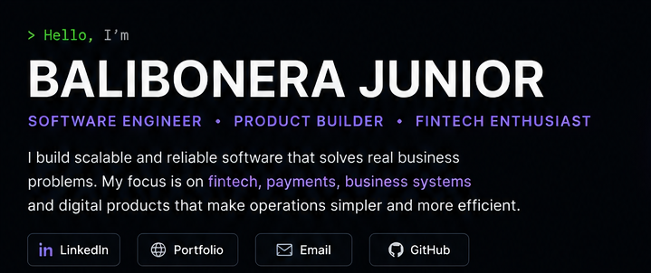

  

# 👋 Hello, I'm Balibonera Junior

### Software Engineer · Product Builder · Fintech

I build scalable software that solves real business problems - from **fintech and payment systems** to **business automation, commerce, and digital products**.

My work spans **frontend, backend, mobile, APIs, integrations, databases, and system architecture**, with a strong focus on turning complex business processes into simple, reliable software.

  
  
  

---

## 🧭 What I Build

| | Area | Focus |
|---|---|---|
| 🏦 | **Fintech & Payments** | Digital banking, payments, virtual accounts, financial APIs |
| ⚙️ | **Business Systems** | POS, inventory, purchasing, customers, reporting |
| 📱 | **Product Engineering** | Web and mobile applications built around real user journeys |
| 🔗 | **Integrations** | Banking APIs, payment gateways, mobile money and enterprise systems |
| 🧩 | **System Architecture** | APIs, authentication, databases, workflows and scalable backends |

---

## 🛠️ Technology

### Languages

  

### Frontend

  

### Mobile

  

### Backend & Data

  

### Tools & Engineering

  

---

## ⭐ Selected Projects

### 🏦 Virtual Account Management

Designing flexible infrastructure for managing **virtual accounts, clients, master accounts, products, account structures, permissions and transaction workflows**.

**Focus:** Financial infrastructure · Account structures · Workflow systems · Enterprise architecture

---

### 🛒 Jenga Stock

A tablet-first **POS and inventory management platform** designed for businesses dealing with purchasing, stock receiving, retail sales, credit sales, pricing and reporting.

**Focus:** POS · Inventory · Purchasing · Customers · Payments · Flutter

---

### 📱 Loan Origination

A mobile field-operations platform for **customer onboarding, group management and loan processing**, designed for financial institutions and field officers.

**Focus:** Flutter · Mobile workflows · REST APIs · Financial services

---

### 💳 Banking & Payment Integrations

Enterprise integrations connecting banking systems with **payment channels, mobile money, APIs and financial messaging infrastructure**.

**Focus:** APIs · Payments · ISO 20022 · Banking systems · Integrations

---

## 🚀 Currently Building

- **Fintech infrastructure** - exploring better ways to model financial accounts, payments and workflows.
- **Business automation** - building tools that simplify commerce, inventory and operational processes.
- **Product experiences** - designing software that makes complex systems feel simple.
- **Scalable architectures** - continuously improving how applications are structured, secured and deployed.

---

## 📊 GitHub

  
  

  

---

## 💡 Engineering Philosophy

> **Build systems that are reliable underneath and simple on the surface.**

I care about clean architecture, thoughtful UX, maintainable code and software that genuinely improves how people work.

---

## 🤝 Let's Build Something Meaningful

I'm interested in collaborating on **fintech, developer tools, business software, APIs, and products that solve meaningful problems.**

  <a href="[YOUR_LINKEDIN_URL](https://www.linkedin.com/in/balibonera-junior/)">LinkedIn</a>
  &nbsp;·&nbsp;
  <a href="[YOUR_PORTFOLIO_URL](https://balibonerajunior.vercel.app/)">Portfolio</a>
  &nbsp;·&nbsp;
  <a href="mailto:juniorbalamage">Email</a>

  Building, learning, and shipping.

